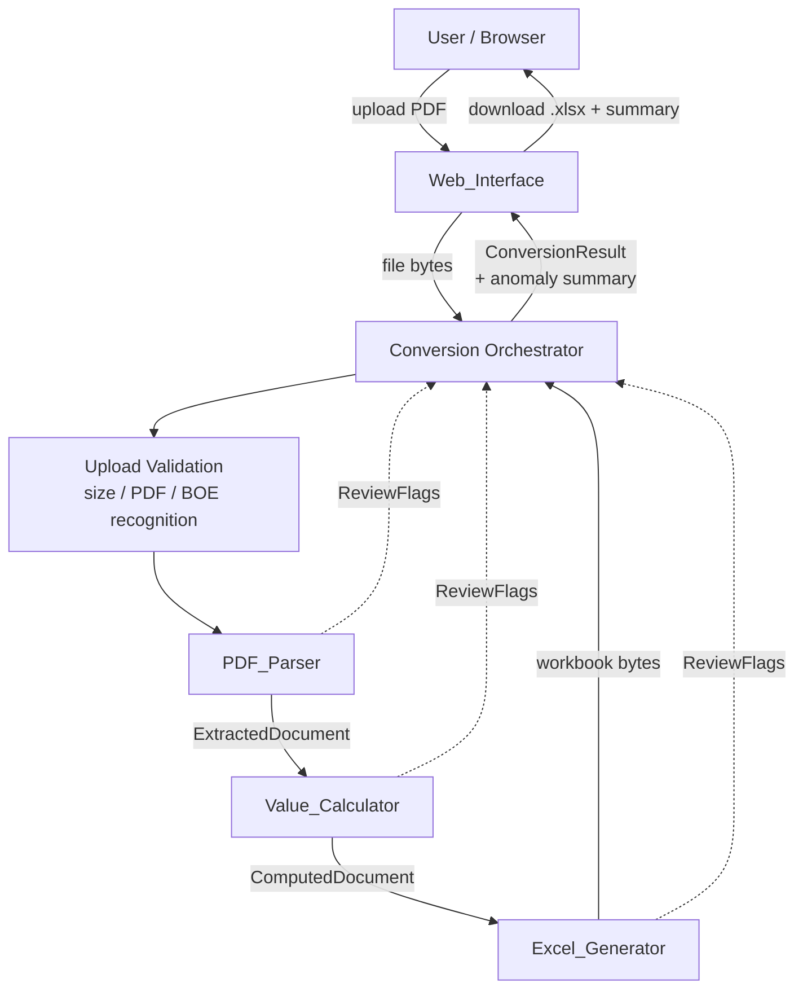

# Design Document

## Overview

The Bill of Entry Converter is a web-based tool that transforms an Indian Customs **Bill of Entry
(BOE)** PDF into a pre-defined Excel workbook in the "CTN" layout. This design covers **Milestone 1**:
faithfully read a BOE PDF and emit the target Excel (`1357 ctn llp.xlsx` layout) with every header
field and line item captured, derived monetary values computed, and any anomaly surfaced to the User
rather than silently dropped.

The guiding constraint is **parsing fidelity**: no line item may be dropped or altered, no value may be
silently substituted, and every extracted value is preserved verbatim. Where a value cannot be read or a
cross-check fails, the system reports it and leaves the affected cell blank rather than guessing.

### Design grounding from the reference files

This design was derived by inspecting the two reference files directly:

- **Source PDF** (`205090022062026INNSA1BE0230620261842.pdf`, 30 pages): An ICEGATE BOE. Line-item data
  is split across two regions:
  - **Part II — Invoice & Valuation Details**: a tabular list of items with columns
    `S.NO | CTH | DESCRIPTION | UNIT PRICE | QUANTITY | UQC | AMOUNT`. Descriptions wrap across lines.
  - **Part III — Duties**: one block per item keyed by `ITEMSN`, carrying `ASSESS VALUE`, `TOTAL DUTY`,
    and a duty grid with `BCD` rate/amount, `SWS` amount, and `IGST` rate, plus exemption notification
    numbers (e.g. `Notn No. 024/2005`) that can drive a zero rate.
  - **Critical extraction hazard**: the BOE renders rotated/vertical section labels (e.g. `SLIATED`,
    `YTUD`, `SEITUD`) in the page margins. Naive full-page text extraction interleaves this rotated text
    with the real horizontal data, producing garbage. The parser **must** filter by character orientation
    and use positional (bounding-box) extraction, not naive `extract_text()`.
- **Target Excel** (`1357 ctn llp.xlsx`, `Sheet1`): A header block in `D1:G8`, an item-table header at
  **row 12** (`A12:Y12`), 45 line items in rows **13–57**, a totals row at **row 61**, and auxiliary
  template sections (`DETAILS AS PER CHALLANS`, `DETAILS AS PER TALLY`, C&F invoice block) below row 71.
  The sample stores most numeric columns as **Excel formulas** (e.g. `L13 = =H13*K13`), with only the
  directly-extracted inputs (`N` assessable value, `Q` GST, `R` IGST rate, `T` BCD rate, `U` BCD amount,
  `V` SWS rate) stored as literal numbers.

### Key design decisions

| Decision | Rationale |
|---|---|
| **Python backend** (FastAPI) with `pdfplumber` + `openpyxl` | Both libraries are present and proven against these exact files during design; `pdfplumber` exposes per-character orientation/coordinates needed to defeat the rotated-label hazard; `openpyxl` writes formulas and preserves precision. |
| **Orientation-aware, coordinate-based parsing** | The BOE's rotated margin labels make naive text extraction unreliable; we extract upright words by bounding box and reconstruct rows geometrically. |
| **Two-pass line-item assembly keyed by Item Serial Number** | Invoice values (Part II) and duty values (Part III) live in different regions; joining on `ITEMSN` is the only reliable way to build one complete record. |
| **Computation in code, not Excel formulas** | Requirement 6/8 mandate full-precision computed values written to the output. We compute every derived value in the `Value_Calculator` and write literal numbers, while reproducing the sample's column layout exactly. (The sample's use of formulas is an implementation detail; writing computed literals yields identical values at full precision and avoids Excel recalculation differences.) |
| **Anomaly model with explicit flags, never silent drops** | Requirements 2.10, 3.3, 3.15, 5.11, 6.13, 9.x require that missing/unreadable values be reported and the row retained. A first-class `ReviewFlag` structure threads through extraction, computation, and writing. |
| **Atomic output** | Requirement 1.7 forbids partial downloads. The workbook is fully built in memory and only offered for download on success. |

## Architecture



### Component responsibilities

- **Web_Interface**: Single-file upload control, processing indicator, error/anomaly messaging, and
  download delivery. Stateless between requests; holds the generated workbook only until download.
- **Conversion Orchestrator**: Sequences validation → parse → compute → generate. Aggregates `ReviewFlag`s
  and discrepancy reports from all components into a single `ConversionResult`. Enforces the 60-second
  budget and atomic-output rule.
- **PDF_Parser**: Orientation-aware extraction of the Header_Block fields (Part I/II) and Line_Item
  records (Part II joined with Part III). Produces an `ExtractedDocument` of verbatim values plus flags.
- **Value_Calculator**: Pure, deterministic computation of all derived per-line and totals values from
  the `ExtractedDocument`. No I/O. Produces a `ComputedDocument`.
- **Excel_Generator**: Writes the `ComputedDocument` into the exact CTN layout (cells, labels, blanks,
  auxiliary templates), preserving precision and applying review-flag blanking.

### Request flow (happy path)

1. User uploads one PDF. Web_Interface shows the processing indicator.
2. Orchestrator validates size (≤ 50 MB), readability, and BOE recognition.
3. PDF_Parser extracts header + line items, attaching flags for anything missing/unreadable.
4. Value_Calculator computes per-line and totals values.
5. Orchestrator cross-checks declared vs extracted item count and declared vs computed invoice total.
6. Excel_Generator builds the workbook in memory.
7. Orchestrator returns the workbook + summary (items extracted, USD total, review-flag count, discrepancies).
8. Web_Interface enables download and shows the summary.

## Components and Interfaces

The interfaces below are expressed in Python type-hint form (the chosen backend), but the contracts are
language-neutral.

### Web_Interface (HTTP API)

```
POST /api/convert
  Request:  multipart/form-data
            - file: the BOE PDF (exactly one)
            - usd_rate: number (User-supplied per Open Q5)
  Response (200): { "download_token": str, "summary": ConversionSummary }
  Response (4xx): { "error_code": str, "message": str }   # size/PDF/BOE-recognition failures
  Response (422): { "error_code": "CONVERSION_FAILED", "message": str }  # post-recognition failure

GET /api/download/{download_token}
  Response (200): application/vnd.openxmlformats-officedocument.spreadsheetml.sheet (the .xlsx bytes)
  Response (404): token unknown/expired
```

`ConversionSummary` is rendered in the UI:

```python
@dataclass(frozen=True)
class ConversionSummary:
    line_items_extracted: int          # Req 9.1
    declared_item_count: int | None    # Req 3.2/3.3
    total_invoice_amount_usd: float    # Req 9.1
    declared_invoice_amount_usd: float | None
    review_flag_count: int             # Req 9.1
    review_flags: list[ReviewFlag]
    discrepancies: list[Discrepancy]   # item-count / invoice-total / recompute mismatches
```

### Upload Validation

```python
class UploadValidator:
    MAX_BYTES = 50 * 1024 * 1024  # Req 1.2

    def validate(self, raw: bytes, filename: str) -> ValidationOutcome:
        """Ordered checks: size limit -> readable PDF -> recognizable BOE.
        Returns the first failure, or OK with an opened document handle."""
```

BOE recognition (Req 1.6) is a positive heuristic: the document must contain the BOE marker tokens
observed on every page (`BILL OF ENTRY`, `Port Code`, `BE No`, the `PART - II` invoice table header, and
the `PART - III` duties header). Absence of these markers => `NOT_A_BOE`.

### PDF_Parser

```python
class PdfParser:
    def parse(self, doc: PdfHandle) -> ExtractedDocument: ...

    # internal stages
    def _upright_words(self, page) -> list[Word]:
        """Return only words whose characters are upright (orientation == 0),
        discarding rotated margin labels. Defeats the rotated-label hazard."""

    def _extract_header(self, pages) -> tuple[HeaderBlock, list[ReviewFlag]]: ...
    def _extract_invoice_items(self, pages) -> dict[int, InvoiceItemRow]:
        """Part II table -> {item_serial: invoice values} (price, qty, uqc, amount, cth, desc)."""
    def _extract_duty_items(self, pages) -> dict[int, DutyItemRow]:
        """Part III blocks -> {item_serial: assess value, BCD rate/amt, SWS amt, IGST rate, total duty}."""
    def _merge_items(self, inv, duty, declared_count) -> tuple[list[LineItem], list[ReviewFlag]]:
        """Join on item_serial; multi-page items merged so each field appears exactly once (Req 3.13).
        Never drops a serial present in either source; missing fields => ReviewFlag (Req 3.15)."""
```

Parsing rules of note:
- **Verbatim capture** (Req 2.11, 3.6): values are stored as the printed string; numeric parsing is a
  separate, non-destructive step that keeps the raw text alongside the parsed number.
- **Zero from exemption** (Req 3.14): a notification that yields a `0` rate/amount is stored as numeric
  `0`, not blank.
- **Multi-page items** (Req 3.13): item blocks spanning a page break are stitched by `ITEMSN`; duplicate
  fragments are de-duplicated so each field value appears once.

### Value_Calculator

```python
class ValueCalculator:
    def compute_line(self, item: LineItem, usd_rate: float) -> ComputedLine: ...
    def compute_totals(self, lines: list[ComputedLine], pkg_count: int | None) -> Totals: ...
    def compute(self, doc: ExtractedDocument, usd_rate: float) -> ComputedDocument: ...
```

All formulas are defined normatively in Requirement 6 and reproduced in **Data Models → Computation
model** below. The calculator is a **pure function**: same inputs always produce the same outputs, no I/O.
Any missing/non-numeric input leaves the dependent value `None` (written blank) and raises a `ReviewFlag`
(Req 6.13).

### Excel_Generator

```python
class ExcelGenerator:
    def generate(self, doc: ComputedDocument, flags: ReviewFlagSet) -> bytes:
        """Build Sheet1 in the exact CTN layout and return .xlsx bytes."""

    def _write_header_block(self, ws, header, flags): ...   # D1:G8
    def _write_item_table(self, ws, lines, flags): ...      # header row 12; data from row 13
    def _write_totals_row(self, ws, totals): ...            # row 61
    def _write_aux_templates(self, ws): ...                 # labels only, data cells empty
```

Writer rules:
- Exactly one sheet named `Sheet1` (Req 8.1).
- Item-table header labels written **character-for-character** as in the sample (Req 5.12, incl. quirks
  like `'Rate Per USDin purcahse '` and `'Ratepurchase per unitPcs/KGS/SET'`).
- Blank columns stay blank for every row (`PARTY NAME`, `BILLING AMOUNT`, `AS PER TALLY NAME`, `CTN` —
  the last three are Manual/External in Milestone 1) (Req 8.6, 5.9, mapping table).
- Review-flagged cells are written blank and recorded for the summary (Req 5.11, 6.13, 4.9).
- Computed values written as full-precision literals (Req 8.5).

## Data Models

### Extracted (verbatim) models

```python
@dataclass(frozen=True)
class RawValue:
    """A value as printed in the BOE plus its parsed interpretation."""
    raw_text: str | None          # exactly as printed; None if field absent
    parsed: float | str | None    # numeric/text interpretation; None if unparseable
    is_missing: bool              # field could not be located at all (Req 2.10/3.15)
    is_unparseable: bool          # located but characters not resolvable (Req 9.2/9.3)

@dataclass(frozen=True)
class HeaderBlock:
    company_name: str             # configuration value (Open Q6: "Gemini Unicom LLP")
    party_name: RawValue          # supplier/third-party name (Req 2.7)
    usd_rate: float               # User-supplied (Open Q5)
    details: RawValue             # e.g. "CO-32 CTN-1357" (Req 4.6)
    invoice_no: RawValue          # Req 2.3
    invoice_date: RawValue        # Req 2.4
    be_no: RawValue               # Req 2.1
    be_date: RawValue             # Req 2.2
    bl_no: RawValue               # Req 2.9 (WHERE present)
    bl_date: RawValue             # Req 2.9
    invoice_amount: RawValue      # Req 2.5
    invoice_currency: RawValue    # Req 2.5
    package_count: RawValue       # PKG/CTN total e.g. 1357 (Req 2.6, 7.5)
    container_details: RawValue   # container number + count (Req 2.8)

@dataclass(frozen=True)
class LineItem:
    item_serial: int              # Req 3.4 (join key)
    cth_hsn: RawValue             # Req 3.5
    description: RawValue         # verbatim, untruncated (Req 3.6)
    unit_price_usd: RawValue      # UPI (Req 3.7)
    quantity: RawValue            # Req 3.8
    unit: RawValue                # UQC (Req 3.8)
    assessable_value: RawValue    # Req 3.9
    bcd_rate: RawValue            # Req 3.10
    bcd_amount: RawValue          # Req 3.10
    igst_rate: RawValue           # Req 3.11
    total_duty: RawValue          # Req 3.12

@dataclass(frozen=True)
class ExtractedDocument:
    header: HeaderBlock
    line_items: list[LineItem]    # one per BOE item, ascending serial
    declared_item_count: int | None
    flags: list[ReviewFlag]
```

### Computed models

```python
@dataclass(frozen=True)
class ComputedLine:
    source: LineItem
    amount_usd: float | None              # Req 6.1  = unit_price_usd * qty
    purchase_inr: float | None            # Req 6.2  = amount_usd * usd_rate
    sws_amount: float | None              # Req 6.3  = bcd_amount * 0.10
    total_customs_duty: float | None      # Req 6.4  = bcd_amount + sws_amount
    igst_amount: float | None             # Req 6.5  = igst_rate * (assess + total_customs_duty)
    combined_duty: float | None           # Req 6.6  = total_customs_duty + igst_amount
    land_cost_excl_gst: float | None      # Req 6.7  = purchase_inr + total_customs_duty
    land_cost_incl_gst: float | None      # Req 6.8  = land_cost_excl_gst + igst_amount
    pcs: float | None                     # Req 5.8  = qty*12 when unit=="DOZ" (trim/case-insensitive)
    purchase_rate_per_unit: float | None  # Req 6.9  = land_cost_excl_gst / qty ; 0 when qty==0 (6.10)

@dataclass(frozen=True)
class Totals:
    total_amount_usd: float        # Req 7.1
    total_assessable_value: float  # Req 7.2
    total_customs_duty: float      # Req 7.2
    total_igst: float              # Req 7.2
    total_land_cost_excl_gst: float
    total_land_cost_incl_gst: float
    package_count: RawValue        # Req 7.5
    # all zero when no line items (Req 7.3)

@dataclass(frozen=True)
class ComputedDocument:
    header: HeaderBlock
    lines: list[ComputedLine]
    totals: Totals
    flags: list[ReviewFlag]
```

### Anomaly model

```python
@dataclass(frozen=True)
class ReviewFlag:
    scope: Literal["header", "line_item", "totals"]
    item_serial: int | None     # set for line_item scope
    field_name: str             # e.g. "assessable_value"
    reason: Literal["MISSING", "UNPARSEABLE", "RECOMPUTE_MISMATCH"]
    raw_text: str | None        # preserved raw text for UNPARSEABLE (Req 9.2)

@dataclass(frozen=True)
class Discrepancy:
    kind: Literal["ITEM_COUNT", "INVOICE_TOTAL", "RECOMPUTE"]
    message: str
    expected: float | int | str | None   # declared/extracted value
    actual: float | int | str | None     # computed/recomputed value
```

### Computation model (normative formulas, Requirement 6/7)

For a line item with unit price `p`, quantity `q`, USD rate `r`, assessable value `a`, BCD amount `b`,
SWS rate fixed at `0.10`, and IGST rate `g` (decimal fraction):

```
amount_usd            = p * q
purchase_inr          = amount_usd * r
sws_amount            = b * 0.10
total_customs_duty    = b + sws_amount
igst_amount           = g * (a + total_customs_duty)
combined_duty         = total_customs_duty + igst_amount
land_cost_excl_gst    = purchase_inr + total_customs_duty
land_cost_incl_gst    = land_cost_excl_gst + igst_amount
purchase_rate_per_unit = land_cost_excl_gst / q   (= 0 if q == 0)
pcs                   = q * 12   (only if unit trimmed/upper == "DOZ", else blank)
```

Totals are column-wise sums over all lines; all totals are `0` when there are no lines.

### Target Excel cell map (grounded in the sample)

Header block (`D` = label, `E`/`G` = value):

| Cell | Content | Source |
|---|---|---|
| D1/E1 | `Company name` / `Gemini Unicom LLP` | Config (Req 4.7) |
| D2/E2 | `Party Name` / supplier name | Direct (Req 4.1) |
| F2/G2 | `USD Rate` / e.g. `95.3` | User-supplied (Req 4.5) |
| D3/E3 | `Details` / e.g. `CO-32 CTN-1357` | Direct (Req 4.6) |
| D4/E4, F4/G4 | `Invoice No` / `Inv Date` | Direct (Req 4.2) |
| D5/E5, F5/G5 | `BE No` / `BE Date` | Direct (Req 4.3) |
| D6/E6, F6/G6 | `B/L NO` / `B/L DATE` | Direct, WHERE present (Req 4.4) |
| D7/F7 | `Eway bill no` / `Eway bill date` (values empty) | Blank (Req 4.8) |
| D8/F8 | `RETTENCE DATE` / `RETTENCE RATE` (values empty) | Blank (Req 4.8) |

Item table header at **row 12**, data rows **13..(12+N)**, columns `A..Y`:

| Col | Header label (verbatim) | Source |
|---|---|---|
| A | `Sr. no.` | Computed sequential 1..N (Req 5.2) |
| B | `PARTY NAME` | Blank all rows (Req 8.6) |
| C | `BILLING AMOUNT` | Blank all rows (Req 8.6) |
| D | `AS PER TALLY NAME` | Manual/External → blank (Open Q3) |
| E | `Description` | Direct (Req 5.3) |
| F | `HSN CODE` | Direct (Req 5.4) |
| G | `CTN` | Manual/External → blank per row; total still summed at G61 (Open Q1) |
| H | `QTY` | Direct (Req 5.6) |
| I | `Unit` | Direct (Req 5.7) |
| J | `pcs` | Computed (Req 5.8/5.9) |
| K | `Unit Price in USD` | Direct (Req 5.5) |
| L | `Amount` | Computed (Req 6.1) |
| M | `Rate Per USDin purcahse ` | Computed (Req 6.2) |
| N | `CUSTOM ASS VALUE` | Direct (Req 5.10) |
| O | `LAND COST OF PURCHASE WITHOUT GST` | Computed (Req 6.7) |
| P | `TOTAL Custom Duty` | Computed (Req 6.4) |
| Q | `GST` | Computed (Req 6.5) |
| R | `RATE OF DUTY IGST` | Direct IGST rate (Req 3.11) |
| S | `total custom duty` | Computed (Req 6.6) |
| T | `RATE OF INTEREST` | Direct BCD rate (misleading label) |
| U | `CUST AIDC` | Direct BCD amount (misleading label) |
| V | `RATE OF INTEREST` | Constant `0.10` SWS rate |
| W | `SURCHARGE` | Computed SWS (Req 6.3) |
| X | `LAND COST OF PURCHASE WITH GST` | Computed (Req 6.8) |
| Y | `Ratepurchase per unitPcs/KGS/SET` | Computed (Req 6.9) |

Totals row at **row 61**: sums for `G, L, M, N, O, P, Q, S, U, W, X`; package count from BOE (Req 7.5).
Auxiliary template labels reproduced verbatim with empty data cells (Req 8.3): `total usd`/`=L61` region
(B71/E71), `DETAILS AS PER CHALLANS` (G71) and its column headers (row 72), `DETAILS AS PER TALLY` (Q71)
and headers, the C&F detail block (B72–B86), and `CLEARANCE AND FORWARDING INVOICE` (G94) with headers
(row 95).

> Layout fidelity note: the sample places line items in rows 13–57 and the totals row at 61, leaving a
> gap. Milestone 1 reproduces the sample's fixed positions exactly (totals at row 61 per Req 8.2). For a
> BOE with a different item count, items still begin at row 13 with no blank rows (Req 5.1); the totals
> row position handling for non-45-item documents is noted as an open layout question (see Open Questions
> in requirements) and defaults to summing the actual populated data range.

<!-- PBT applicability: The Value_Calculator and line-item assembly are pure, input-driven logic with
universal invariants (completeness, ordering, arithmetic relationships, round-trips). PBT IS applicable.
Proceeding to prework before writing Correctness Properties. -->

## Correctness Properties

*A property is a characteristic or behavior that should hold true across all valid executions of a
system — essentially, a formal statement about what the system should do. Properties serve as the bridge
between human-readable specifications and machine-verifiable correctness guarantees.*

The properties below were derived from the prework analysis. Field-level extraction criteria against the
single reference PDF (2.1–2.9, 3.4–3.12, 7.7, 1.x UI flows) are validated by example/integration tests
(see Testing Strategy) rather than properties, because we do not synthesize BOE PDFs. The properties
target the pure, input-driven logic: line-item completeness, value computation, aggregation, precision,
placement, and anomaly handling.

### Property 1: No line item is ever dropped, and missing/failed fields are flagged

*For any* collection of line items where an arbitrary subset of required fields is missing or fails to
parse, every such line item still appears in the output exactly once, and each missing or unparseable
field produces a `ReviewFlag` identifying that line item and field, with no inferred or default value
substituted.

**Validates: Requirements 3.1, 3.15, 5.11, 9.5, 2.10**

### Property 2: Extracted item count is preserved and mismatches are reported

*For any* extracted set of line items with a declared item count, the number of records equals the number
of distinct item serials; and *for any* declared/extracted count pair that differs, a `Discrepancy` of
kind `ITEM_COUNT` is produced carrying both the declared and extracted counts and the output is not marked
complete.

**Validates: Requirements 3.2, 3.3**

### Property 3: Extraction preserves printed values verbatim (capture round-trip)

*For any* printed field value (including multi-line/wrapped descriptions), the captured `raw_text` equals
the source characters exactly, with no truncation, reformatting, rounding, or inference.

**Validates: Requirements 2.11, 3.6**

### Property 4: Multi-page item merge is equivalent to the unsplit item

*For any* line item whose source block is split across a page boundary at an arbitrary point, the merged
record equals the record produced from the unsplit block, with each field value appearing exactly once.

**Validates: Requirements 3.13**

### Property 5: Per-line monetary computations satisfy their formulas and algebraic relations

*For any* line item with numeric inputs (unit price, quantity, USD rate, assessable value, BCD amount,
IGST rate), the computed values satisfy: `amount_usd = unit_price * qty`;
`purchase_inr = amount_usd * usd_rate`; `sws_amount = bcd_amount * 0.10`;
`total_customs_duty = bcd_amount + sws_amount`;
`igst_amount = igst_rate * (assessable_value + total_customs_duty)`;
`combined_duty = total_customs_duty + igst_amount`;
`land_cost_excl_gst = purchase_inr + total_customs_duty`;
`land_cost_incl_gst = land_cost_excl_gst + igst_amount`; and
`purchase_rate_per_unit = land_cost_excl_gst / qty`, except that when `qty == 0` the rate is `0` with no
division performed.

**Validates: Requirements 6.1, 6.2, 6.3, 6.4, 6.5, 6.6, 6.7, 6.8, 6.9, 6.10**

### Property 6: pcs is QTY×12 exactly when the unit is DOZ, otherwise blank

*For any* line item, if the unit string with leading/trailing whitespace trimmed and case ignored equals
`"DOZ"` then `pcs == qty * 12`; otherwise the `pcs` cell is blank.

**Validates: Requirements 5.8, 5.9**

### Property 7: Missing or non-numeric inputs leave dependent values blank and flagged

*For any* line item in which a required computation input is missing or non-numeric, every value that
depends on that input is left blank (no default substituted) and the line item is flagged as requiring
User review.

**Validates: Requirements 6.13**

### Property 8: Column totals equal the sums of their per-line values, zero when empty

*For any* list of computed lines, each totals-row figure (total invoice amount USD, assessable value,
total customs duty, IGST, land cost excluding GST, land cost including GST) equals the sum of the
corresponding per-line values; and when the list is empty every total equals zero.

**Validates: Requirements 7.1, 7.2, 7.3**

### Property 9: Sr. no. forms the consecutive sequence 1..N and rows are dense and ascending

*For any* N line items written to the output, the `Sr. no.` column over the data rows equals the sequence
`1, 2, …, N` with no gaps, repeats, or skips, the items appear in ascending item-serial order beginning
at row 13, and there are no blank rows between records.

**Validates: Requirements 5.1, 5.2**

### Property 10: Every value is written to its mapped cell unchanged at full precision

*For any* document, each extracted and each computed value is written into its mapped Item_Table /
Header_Block / Totals_Row cell equal to the source value, preserving full floating-point precision with
no rounding, truncation, or reformatting.

**Validates: Requirements 4.1, 4.2, 4.3, 4.4, 4.5, 4.6, 4.7, 5.3, 5.4, 5.5, 5.6, 5.7, 5.10, 6.11, 6.12, 7.4, 7.5, 8.4, 8.5**

### Property 11: No-source and sample-empty cells are always empty

*For any* document, cells that have no BOE/configuration source (e.g. Eway bill no/date, Remittance
date/rate) and columns left empty in the sample for all line items (e.g. `PARTY NAME`, `BILLING AMOUNT`,
and the Milestone-1 Manual/External columns `AS PER TALLY NAME`, `CTN`), and any cell whose source was
flagged missing, contain no value — no characters, spaces, or placeholder text.

**Validates: Requirements 4.8, 4.9, 8.6**

### Property 12: Output structure and fixed labels match the sample exactly

*For any* document, the output workbook contains exactly one worksheet named `Sheet1`; the Header_Block
occupies rows 1–8, the Item_Table header is at row 12 with each column label a character-for-character
match of the sample, line items occupy the rows immediately below, and the Totals_Row and auxiliary
section labels appear at the sample's cell positions with their data cells empty.

**Validates: Requirements 5.12, 8.1, 8.2, 8.3**

### Property 13: Invoice-total verification reports out-of-tolerance differences

*For any* computed total invoice amount and declared total invoice amount that differ by more than
0.01 USD, a `Discrepancy` of kind `INVOICE_TOTAL` is produced carrying both values and the workbook is
retained; *for any* pair differing by 0.01 USD or less, no such discrepancy is produced.

**Validates: Requirements 7.6**

### Property 14: Extracted-vs-recomputed mismatches beyond tolerance are reported

*For any* numeric value extracted from the BOE that differs from the value recomputed from its related
fields by more than 0.01 in that value's unit, a `Discrepancy` of kind `RECOMPUTE` is produced reporting
both the extracted and the recomputed value; differences within 0.01 produce none.

**Validates: Requirements 9.4**

### Property 15: Unparseable fields retain raw text, are flagged, and are not removed

*For any* line-item field whose text cannot be parsed into its expected data type, the raw extracted text
is written to the output, the field is marked with a visible review indication, and the field/line is not
removed.

**Validates: Requirements 9.2, 9.3**

### Property 16: Completion summary accurately reflects the conversion

*For any* successfully converted document, the summary reports `line_items_extracted` equal to the number
of line items in the output, `total_invoice_amount_usd` equal to the computed sum of per-line USD amounts,
and `review_flag_count` equal to the number of review flags raised.

**Validates: Requirements 9.1**

### Property 17: Failure after BOE recognition yields no downloadable output

*For any* failure occurring after the document is recognized as a BOE, the converter reports that the
conversion could not be completed and no partial or complete workbook is made available for download.

**Validates: Requirements 1.7**

## Error Handling

Errors are partitioned into **rejections** (before/at validation — no output, clear user message) and
**anomalies** (during extraction/computation — output retained, flagged for review). This split directly
implements the requirements' distinction between "do not produce output" and "do not silently drop data".

### Rejections (no output produced)

| Condition | Detection point | User message | Requirement |
|---|---|---|---|
| File > 50 MB | UploadValidator (size) | "File exceeds the 50 MB size limit." | 1.2 |
| Not a readable PDF | UploadValidator (open) | "A valid PDF is required." | 1.5 |
| Not recognizable as BOE | UploadValidator (markers) | "The document is not a recognized Bill of Entry." | 1.6 |
| Failure after BOE recognition | Orchestrator (catch) | "The conversion could not be completed." | 1.7, atomic — no partial file |

Validation is **ordered** (size → readable → BOE) so the first applicable message is returned. The
workbook is built entirely in memory and a `download_token` is only issued after a fully successful build,
guaranteeing atomicity (Property 17).

### Anomalies (output retained, flagged)

| Condition | Handling | Requirement |
|---|---|---|
| Missing header field | Record `RawValue(is_missing=True)`, emit `ReviewFlag(header, field, MISSING)`, leave cell empty | 2.10, 4.9 |
| Missing line-item field | Emit `ReviewFlag(line_item, serial, field, MISSING)`, keep the line, blank only that cell | 3.15, 5.11 |
| Unparseable field | Keep `raw_text`, write raw text to cell, emit `ReviewFlag(..., UNPARSEABLE, raw_text=...)` | 9.2, 9.3 |
| Missing/non-numeric computation input | Leave dependent computed values `None`/blank, emit `ReviewFlag`, no default | 6.13 |
| Extracted count ≠ declared count | Emit `Discrepancy(ITEM_COUNT, expected=declared, actual=extracted)`, mark output not complete | 3.3 |
| Computed invoice total vs declared > 0.01 USD | Emit `Discrepancy(INVOICE_TOTAL, …)`, retain workbook | 7.6 |
| Declared invoice total absent/unreadable | Report "computed invoice total could not be verified against the BOE" | 7.7 |
| Extracted vs recomputed value diff > 0.01 | Emit `Discrepancy(RECOMPUTE, expected=extracted, actual=recomputed)` | 9.4 |
| qty == 0 for rate-per-unit | Set rate to 0, no division | 6.10 |

### Defensive boundaries

- The PDF_Parser isolates extraction failures per field so one bad field cannot abort the whole document
  (supports Property 1 / Req 9.5).
- The Value_Calculator is pure and total: it never throws on bad input; it returns `None` + flag.
- The 60-second budget (Req 1.3) is enforced by the Orchestrator; exceeding it is treated as a
  post-recognition failure (1.7) with no partial output.

## Testing Strategy

This feature mixes pure logic (ideal for property-based testing) with single-document extraction and UI
flows (best covered by example/integration tests). We use both.

### Property-based testing

PBT applies to the line-item assembly, the Value_Calculator, the totals aggregation, the anomaly model,
and the writer's placement/precision/emptiness invariants — all pure, input-driven logic with universal
properties.

- **Library**: `hypothesis` (Python). Do not hand-roll generators/shrinking.
- **Iterations**: each property test runs a minimum of 100 examples
  (`@settings(max_examples=100)` or higher).
- **Generators**: build `LineItem`/`HeaderBlock` strategies producing valid, missing, and non-numeric
  field variants; descriptions including wrapped/multi-line and non-ASCII text; units with whitespace and
  mixed case (incl. `"DOZ"`, `" doz "`, `"Doz"`); quantities including `0`; and numeric values across a
  wide magnitude/precision range. A dedicated strategy splits an item block at an arbitrary boundary for
  Property 4.
- **Output inspection**: writer properties open the generated `.xlsx` with `openpyxl` and assert cell
  coordinates, values, labels, and emptiness.
- **Tagging**: each property test carries a comment
  `# Feature: bill-of-entry-converter, Property {number}: {property_text}` and maps 1:1 to a property
  above (Properties 1–17). Float comparisons use the requirement-specified 0.01 tolerance where relevant
  and exact equality where full precision is asserted.

### Example-based unit tests

- Header-field extraction (Req 2.1–2.9) and per-line field extraction (Req 3.4–3.12) asserted against the
  reference PDF's known values, including the exemption-zero case (3.14) and a multi-page item.
- `pcs` blank/compute boundary examples; qty==0 rate example (6.10); empty-document totals (7.3).
- Declared-total-absent verification message (7.7).
- Item-table and auxiliary header labels compared to the exact strings captured from the sample workbook
  (including quirks such as `'Rate Per USDin purcahse '` and `'Ratepurchase per unitPcs/KGS/SET'`).

### Integration & smoke tests

- **End-to-end** (Req 1.3, 1.8): convert the reference PDF with `usd_rate = 95.3` and assert a downloadable
  `Sheet1` workbook is produced within 60 seconds, with 45 line items and the totals row at row 61.
- **Golden-output comparison**: compare the generated workbook's evaluated values against the sample
  `1357 ctn llp.xlsx` (the sample stores formulas; compute their values for comparison) within tolerance,
  confirming the design's "compute literals" approach reproduces the sample.
- **Rejection paths** (Req 1.2, 1.5, 1.6): oversized file, corrupt/non-PDF bytes, and a valid non-BOE PDF
  each yield the correct message and no output.
- **Atomicity** (Req 1.7): inject a post-recognition failure and assert no `download_token` is issued.
- **UI smoke** (Req 1.1, 1.4, 1.8): single-file control, processing indicator visibility, and download
  availability after success.

### Orientation-robustness regression

A targeted test asserts that the parser's `_upright_words` filter excludes the BOE's rotated margin labels
(e.g. `SLIATED`, `YTUD`, `SEITUD`), guarding against regressions where rotated text contaminates extracted
rows — the primary extraction hazard identified during design.
